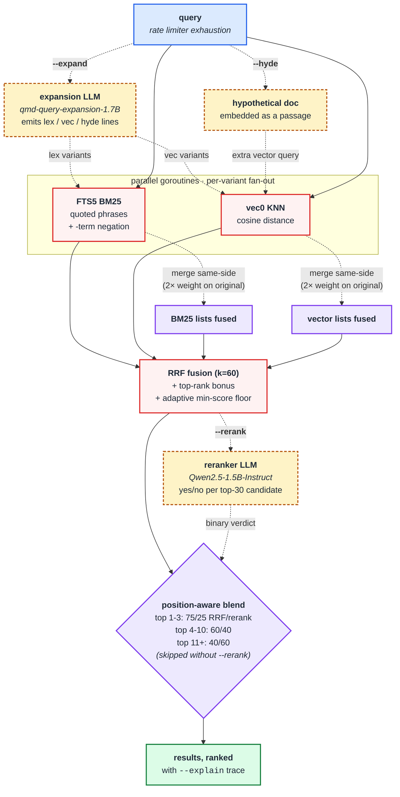

<p align="center">
  
</p>

<p align="center">
  <strong>Local search engine for your notes and documents.</strong><br>
  Markdown, plain text, meeting transcripts, knowledge bases.<br>
  BM25 + vector + hybrid fusion in a single Go binary.
</p>

<p align="center">
  <a href="https://go.dev"></a>
  <a href="LICENSE"></a>
  <a href="#installation"></a>
  <a href="https://github.com/ugurcan-aytar/recall/actions/workflows/ci.yml"></a>
  <a href="CONTRIBUTING.md"></a>
</p>

<p align="center">
  
</p>

---

## What is recall?

recall is an on-device search engine for your personal knowledge base — markdown notes, plain-text files, meeting transcripts, journals, docs. Point it at a folder of writing and it gives you:

- **BM25 full-text search** via SQLite FTS5 — fast, deterministic keyword matching.
- **Vector semantic search** via sqlite-vec — find notes by meaning, not just exact words.
- **Hybrid fusion** — BM25 and vector results combined with Reciprocal Rank Fusion and an adaptive score floor, so vague queries still surface their best match instead of returning nothing.
- **Markdown-aware chunking** — 384-token chunks with 15% overlap, scored at natural break-points so headings stay with their bodies.
- **Local embedding** — a ~146 MB GGUF model (nomic-embed-text-v1.5, Apache 2.0, ungated) runs via a llama.cpp `llama-server` subprocess on a local Unix socket. No API calls, no cloud — the first `recall embed` auto-fetches the ~40 MB llama.cpp prebuilt into `~/.recall/bin/llamacpp/<version>/`, then everything is offline.

Everything lives in one SQLite file and one Go binary. No servers, no Docker, no Node runtime, no Python runtime.

> **Also works with source code.** If you keep READMEs, design docs, and codebases in the same tree, recall indexes them alongside your notes and uses tree-sitter for AST-aware chunking on Go / Python / TypeScript / JavaScript / Java / Rust. Notes are the main use case; code is a natural extension.

## Who is this for?

- You've built up a `~/notes` folder over years and can't find things in it.
- Your team's knowledge base is a pile of markdown across a few repos.
- You run meeting transcripts through a transcription tool and now have hundreds of `.md` files you'd like to query.
- You want "grep for ideas, not just strings" without handing your notes to a cloud service.

## Why another search engine?

Knowledge-base search usually pushes you toward a hosted vector DB, a Node or Python stack, and an OpenAI key. recall takes the opposite position:

- **Local-first, always.** The default path makes zero HTTP requests. Your notes never leave your machine.
- **One binary.** `make build` and you're done — no external services to keep alive.
- **Incremental.** Edit one paragraph; recall re-embeds one chunk, not the whole file.
- **Adaptive scoring.** Vague queries still surface their best result instead of returning an empty list.
- **Library-first.** The CLI is a thin wrapper over `pkg/recall`, so other Go programs can embed the same engine.

recall is designed to be boring infrastructure for your notes. Index once, search forever.

## Quick start

```bash
# 1. Install
brew install ugurcan-aytar/recall/recall    # or grab a binary from releases

# 2. Point recall at a folder of notes
recall collection add ~/notes --name notes  # or any folder of .md / .txt files
recall index

# 3. Full-text search (works immediately, no model needed)
recall search "rate limiter"

# 4. Search syntax: quoted phrases and exclusion
recall search '"circuit breaker" timeout -redis'
#      └── matches docs with the exact phrase "circuit breaker"
#          and the word "timeout", excluding anything that mentions redis.

# 5. (Optional) hybrid BM25 + vector — needs an embedding backend
export RECALL_EMBED_PROVIDER=openai
export OPENAI_API_KEY=sk-…
recall embed
recall query "what did we decide about the launch date" --explain
```

Want to try recall without pointing it at your own data? Clone the repo and use the bundled `examples/` folder of fictional meeting notes, runbook, journal, and incident report:

```bash
git clone https://github.com/ugurcan-aytar/recall.git
recall collection add ./recall/examples --name demo
recall index
recall search "circuit breaker"
```

To use recall on your own notes, replace `./examples` with `~/notes` (or wherever your markdown lives).

## How retrieval works

recall implements the same retrieval pipeline most modern hybrid search systems use, in pure Go, on top of SQLite. Retrieval (BM25, vector KNN, RRF fusion) runs in-process. Embedding and generation shell out to the official llama.cpp `llama-server` over a local Unix socket — auto-downloaded on first use, no CGo on the inference path.

The default path (`recall query "<q>"`) is the lean BM25 + vector + RRF flow on the left of the diagram below. The dashed boxes — query expansion, HyDE, and the position-aware reranker — are opt-in via `--expand`, `--hyde`, and `--rerank`. Each opt-in stage gracefully no-ops when its required model isn't available, so the dashed path is never load-bearing.



### BM25

`recall search` runs SQLite FTS5's `bm25()` ranking function over every indexed document. FTS5 returns negative scores (lower = better); recall flips them positive for display. Snippets come from FTS5's built-in `snippet()` with bold ANSI markers around matched terms (suppressed when `NO_COLOR` is set).

Performance: ~5 ms wall time per query on a 79-document / 189-chunk corpus including process startup. The actual SQL runs in microseconds.

### Vector

`recall vsearch` embeds the query (`search_query: …` prefix per nomic's required format), then runs a KNN cosine-distance query against the `chunk_embeddings` `vec0` virtual table. The store keeps **one row per document** (best chunk wins) so results are document-level, not chunk-level.

Similarity is reported as `1 / (1 + distance)` so closer = higher score, easy to compare against BM25's positive-flipped values.

### RRF Fusion

`recall query` runs BM25 and vector concurrently in two goroutines, then fuses the two ranked lists with **Reciprocal Rank Fusion** (Cormack et al. 2009). The classic RRF score for a document `d` is:

```
score(d) = Σ  1 / (k + rank(d, list))
         lists
```

with `k = 60` (the canonical TREC value). recall layers two practical refinements on top:

| Refinement | Value | Purpose |
|---|---|---|
| Top-rank bonus | +0.05 if doc is rank 1 in either list, +0.02 for ranks 2–3 | Boost results that one of the rankers considers obviously best |
| Adaptive min-score floor | drop results below `0.4 × top.Score` | Trim long-tail noise on weak queries — but the floor is *relative*, so weak-but-best results survive instead of returning empty |

`recall query --explain` prints the per-result trace so you can see exactly why each document landed where it did:

```
notes/incident-2026-03-22.md  #07d4c5  (score 0.08)
[explain 1] notes/incident-2026-03-22.md  rrf=0.0328 bonus=0.0500 floor=0.0331 bm25_rank=1 vec_rank=1
```

### Chunking

Documents bigger than the target are split with break-point scoring: H1 = 100, H2 = 90, code fence = 80, blank line = 20, list item = 5, regular line break = 1. The chunker hunts back ≤200 tokens for the highest-scoring break point near the cut point, then echoes the last 15% of each chunk into the next so context spans the seam. Code fences are never split mid-block.

For source files (`.go`, `.py`, `.ts`, `.js`, `.java`, `.rs`) the chunker uses `tree-sitter` to cut at function / method / class / impl / import boundaries instead. Languages without a tree-sitter grammar fall back to the markdown chunker silently.

Default target is **384 estimated tokens** (chunked content fits comfortably under typical BERT-class embedder context windows). Override with `--chunk-strategy` on `recall embed`.

### Incremental re-embedding

When you edit a file and re-run `recall index`, only the chunks whose `content_hash` changed get re-embedded. Editing one paragraph of a 50-page note costs ~1 chunk re-embed, not 50.

## Commands

| Command | What it does |
|---|---|
| `recall collection add <path>` | Register a folder as a collection |
| `recall collection remove <name>` | Remove a collection |
| `recall collection list` | List registered collections |
| `recall collection rename <old> <new>` | Rename a collection |
| `recall ls [collection[/path]]` | List files in a collection |
| `recall index` | Re-scan and index all collections |
| `recall index --pull` | `git pull` each collection before re-indexing |
| `recall embed` | Generate vector embeddings for chunks |
| `recall embed -f` | Force re-embed everything |
| `recall search "<query>"` | BM25 full-text search |
| `recall vsearch "<query>"` | Vector semantic search |
| `recall query "<query>"` | Hybrid: BM25 + vector + RRF fusion |
| `recall query "<query>" --explain` | Hybrid + per-result RRF / bonus / floor / rank trace |
| `recall get <path \| #docid>` | Retrieve a single document |
| `recall multi-get <pattern>` | Batch retrieve by glob or list |
| `recall context add [path] "text"` | Add descriptive context for a path |
| `recall context list` / `rm` / `check` | Manage path contexts |
| `recall status` | Index health, collection sizes, doc / chunk / embedding counts |
| `recall doctor` | Verify database, schema, embedding backend |
| `recall models` / `models download` / `models path` | List, fetch, or locate GGUF models |
| `recall cleanup` | Drop orphan chunks + stale embeddings, run SQLite VACUUM |
| `recall version` | Print version, build date, commit, Go version |

Shared search flags: `-n`, `-c/--collection` (comma-separated for multi-collection), `--all`, `--min-score`, `--full`, `--line-numbers`, `--explain`. Output formats: `--json`, `--csv`, `--md`, `--xml`, `--files`.

### Multi-collection cross-search

Index two repos as separate collections, then search either one, the other, or both at once with `-c repo1,repo2`:

<p align="center">
  
</p>

## Architecture

```
recall
├── cmd/recall/        # CLI entry point (thin main.go)
├── internal/
│   ├── commands/      # One Cobra command per file
│   ├── store/         # SQLite + FTS5 + sqlite-vec + RRF fusion
│   ├── chunk/         # Markdown chunker + tree-sitter AST chunker for code
│   └── embed/         # Local GGUF backend + optional API fallback
└── pkg/recall/        # Public Go API (for library consumers)
```

The pieces:

- **store** — `mattn/go-sqlite3` (with the `sqlite_fts5` build tag) plus `asg017/sqlite-vec-go-bindings/cgo`. WAL mode, 64 MB cache, prepared statements cached for the BM25 hot path.
- **chunk** — markdown break-point scoring is the default. Code files route through `smacker/go-tree-sitter` for AST-aware cuts. Strategy is overridable via `--chunk-strategy auto|regex|ast`.
- **embed** — local GGUF via the official llama.cpp prebuilt `llama-server` binary running as a subprocess on a Unix socket. recall downloads the platform-appropriate llama.cpp release on first `recall embed` (~30-40 MB, one-time, into `~/.recall/bin/llamacpp/<version>/`), spawns it with `--embedding`, and talks to `/v1/embeddings` (OpenAI-compatible batch input) over the socket. The model loads once for the lifetime of the embed run; HTTP round-trips on a local socket are negligible. BM25-only commands never start a subprocess. Optional API fallback (`RECALL_EMBED_PROVIDER=openai|voyage`) is opt-in only and never default.
- **pkg/recall** — a stable facade (`NewEngine`, `SearchBM25`, `SearchVector`, `SearchHybrid`, `Index`, `Embed`, `Get`, …) that external Go consumers import.

## Installation

### Homebrew (macOS, Linux)

```bash
brew install ugurcan-aytar/recall/recall
```

### One-line install script

```bash
curl -fsSL https://raw.githubusercontent.com/ugurcan-aytar/recall/main/install.sh | bash
```

The script picks the right pre-built tarball for your OS / arch from the [latest release](https://github.com/ugurcan-aytar/recall/releases/latest), verifies its SHA-256, and installs to `/usr/local/bin` (root) or `~/.local/bin` (user).

### Pre-built binary

Grab a tarball directly from the [releases page](https://github.com/ugurcan-aytar/recall/releases/latest), extract it, and drop the `recall` binary anywhere on your `$PATH`. Currently shipped: `darwin_arm64`, `linux_amd64`. SHA-256 sums in `checksums.txt`.

### From source

For contributors and anyone on a platform without a pre-built binary:

```bash
git clone https://github.com/ugurcan-aytar/recall.git
cd recall
make build         # → ./recall
```

Requires Go 1.24+ with CGo enabled (the default). If you `go install` instead of cloning, you need the `sqlite_fts5` tag — recall hard-fails with an actionable error otherwise:

```bash
go install -tags sqlite_fts5 github.com/ugurcan-aytar/recall/cmd/recall@latest
```

## Vector / hybrid search (optional)

`recall search` (BM25 full-text) works the moment you install — no model, no API. `recall vsearch` and `recall query` need an **embedding backend**. Pick whichever fits how you installed:

**Brew / pre-built users**: the bottle ships **without** the local GGUF model (~146 MB on disk, won't fit in a tap). Use an API:

```bash
export RECALL_EMBED_PROVIDER=openai     # or voyage
export OPENAI_API_KEY=sk-…              # or VOYAGE_API_KEY
recall embed
recall query "your question"
```

`RECALL_EMBED_PROVIDER` defaults to `local`, so the API path is opt-in only — recall never sends data anywhere unless you explicitly set the env var.

**Pre-built binaries include local embedding AND local generation.** No source build needed. On the first `recall embed`, recall downloads the official llama.cpp prebuilt `llama-server` (~30-40 MB) into `~/.recall/bin/llamacpp/<version>/` and the embedding model itself (use `recall models download` for that — ~146 MB for nomic-embed). Generation features (`--expand` / `--rerank` / `--hyde`) talk to the same binary via a separate subprocess per model: `recall models download --expansion` (~1.3 GB) and `recall models download --reranker` (~1.1 GB). After the first run everything is offline.

Run `recall doctor` any time to see which backend the current binary will use.

## Configuration

| Environment variable | Default | Purpose |
|---|---|---|
| `RECALL_DB_PATH` | `~/.recall/index.db` | SQLite database location |
| `RECALL_MODELS_DIR` | `~/.recall/models/` | GGUF model storage |
| `RECALL_EMBED_PROVIDER` | `local` | `local` (default), `openai`, or `voyage` |
| `RECALL_EMBED_MODEL` | `nomic-embed-text-v1.5.Q8_0.gguf` | Override the local GGUF — bare filename joined with `RECALL_MODELS_DIR`, or absolute path |
| `RECALL_EMBED_PROMPT_FORMAT` | _detected from filename_ | Force a prompt family — `nomic`, `gemma` / `embeddinggemma`, `qwen` / `qwen3`, or `generic` / `raw` / `none` |
| `RECALL_EMBED_WORKERS` | `1` | Parallel embedder workers. Local backend loads N model instances (~146 MB each); API backend fires N concurrent HTTP requests. Capped at 8. |
| `RECALL_EXPAND_MODEL` | `qmd-query-expansion-1.7B-q4_k_m.gguf` | Override the GGUF used by `--expand` and (eventually) `--hyde`. Bare filename joins with `RECALL_MODELS_DIR`; absolute path passes through. |
| `RECALL_RERANK_MODEL` | `qwen2.5-1.5b-instruct-q4_k_m.gguf` | Override the GGUF used by `--rerank`. Same path-resolution rules as `RECALL_EXPAND_MODEL`. |
| `OPENAI_API_KEY` | — | Only read when `RECALL_EMBED_PROVIDER=openai` |
| `VOYAGE_API_KEY` | — | Only read when `RECALL_EMBED_PROVIDER=voyage` |
| `NO_COLOR` | — | Set to any value to disable ANSI colors |

### Bringing your own embedding model

The default `nomic-embed-text-v1.5` covers most use cases, but you can
point recall at a different GGUF without rebuilding:

```sh
# Drop a model into RECALL_MODELS_DIR (default ~/.recall/models/)
mv ~/Downloads/embeddinggemma-300m.Q8_0.gguf ~/.recall/models/

# Tell recall to use it
export RECALL_EMBED_MODEL=embeddinggemma-300m.Q8_0.gguf
recall embed -f          # -f drops old vectors that were embedded with nomic
recall query "..."
```

Recall auto-detects the prompt family from the filename — `nomic-`,
`embeddinggemma-`, and `Qwen3-Embedding-` patterns are recognised and
get the right `task: …` / `Instruct: …` / `search_query: …` prefix
applied. Set `RECALL_EMBED_PROMPT_FORMAT` if you have a model whose
filename doesn't hint at its family. The model dimension must match
recall's vec0 schema (768d); embedders that return a different width
will fail at `recall embed` with a clear error.

### Query expansion (`--expand`)

`recall query` runs BM25 + vector + RRF on the user's literal query.
For natural-language questions where the query and the doc use
different vocabulary ("decide" vs "decisions"), even hybrid search can
miss obvious matches. `--expand` asks a small local LLM to rewrite the
query into a few BM25-friendly keyword variants and a few semantic
phrasings, then fuses the extra retrieval lists with a 2× weight on
the user's original phrasing so aggressive variants can't out-vote it.

```sh
# One-time: download the expansion model (qmd-query-expansion-1.7B,
# MIT-licensed, ungated, ~1.3 GB GGUF). Same library backs --expand
# now and --hyde when that lands.
recall models download --expansion

# Use the flag on any hybrid query.
recall query --expand "what did the team decide about authentication"

# Optional intent line to disambiguate two-word nouns ("performance"
# could mean web latency, financial returns, athletic, …).
recall query --expand --intent "web page latency" "performance"
```

The flag is opt-in for two reasons: the expansion model is an extra
~1.3 GB download, and each `--expand` query pays one LLM-inference
roundtrip (~1-3s on a modern laptop). Without the flag — or when the
model isn't downloaded — `recall query` runs the original
single-query hybrid path with zero LLM cost.

To swap the model out for a different generation GGUF (e.g. you want
to A/B against Qwen2.5-1.5B-Instruct), drop it under
`RECALL_MODELS_DIR` and set `RECALL_EXPAND_MODEL=my-llm.gguf`. Output
parsing expects `lex: …` / `vec: …` / `hyde: …` lines (the qmd
expansion-model format); a model that emits anything else won't
crash but won't produce useful variants either.

### HyDE — embedding hypothetical answers (`--hyde`)

`--hyde` (Hypothetical Document Embedding) asks the same expansion
LLM to write a short imagined answer to the query, then embeds that
hypothetical passage in the same vector space as your real
documents. Vector search runs against both the real query embedding
AND the hypothetical-answer embedding; results are RRF-fused.

The intuition: if the user types "what's the recovery timeout for
the circuit breaker pattern?", a real document about circuit
breakers is more likely to land near a *hypothetical answer* about
circuit breakers than near the bare *question*. The hypothetical
acts as a richer query.

```sh
# Same model + download as --expand:
recall models download --expansion

recall query --hyde "what is the recovery timeout for the circuit breaker"
recall query --expand --hyde "what did the team decide about authentication"
```

`--expand` and `--hyde` share one LLM call when both flags are on
— the qmd-format model emits `lex / vec / hyde` in a single
response, so there's no extra cost for combining them.

**Auto-intent fix**: when you target a single collection (`-c`)
and that collection has a context blurb (`recall collection add
--context "…"`), recall passes the blurb as `Query intent: …` to
the LLM. qmd skipped this for HyDE generation and the resulting
hypothetical passages were noticeably less on-topic; recall fixes
that. An explicit `--intent` flag still wins over the auto-fill.

### Reranking (`--rerank`)

`--rerank` sends the top-N RRF results through a small instruction-
tuned LLM that answers a binary "does this passage answer the
query?" question per candidate. Yes-answers float to the top, no-
answers sink. The verdict is binary (1.0 / 0.0); fine-grained
ordering inside each bucket is preserved by stable sort, so the
RRF rank survives as a tiebreaker.

```sh
# One-time: download the reranker model (Qwen2.5-1.5B-Instruct,
# Apache 2.0, ungated, ~1.1 GB).
recall models download --reranker

# Use the flag on any hybrid query.
recall query --rerank "circuit breaker recovery timeout"

# Combine with --expand for the full pipeline.
recall query --expand --rerank "what did the team decide about authentication"

# Tune how many RRF hits get reranked (default 30).
recall query --rerank --rerank-top-n 50 "..."
```

The flag is opt-in for the same reasons as `--expand`: separate
~1.1 GB download, and one LLM-inference call per candidate
(measured ~70 ms per call on a modern laptop, so 30 candidates
≈ 2 s per query). Without the flag the query path stays untouched.

**A note on quality**: ideally we'd use a true cross-encoder
(Qwen3-Reranker-0.6B with `--pooling rank`), but llama.cpp's
rank-pooling endpoint isn't yet exposed by `llama-server`.
Until it is, recall uses an instruct model (Qwen2.5-1.5B) with
a binary yes/no prompt — empirical POC showed 5/5 correct
discrimination on a realistic 5-doc corpus. When llama-server
ships rank pooling, recall will drop in the actual reranker
model without breaking the flag's contract.

**Position-aware blending**: the binary verdict alone would throw
away the RRF signal. Instead, recall combines the two scores with
weights that depend on the candidate's RRF rank — top-3 hits get
a 75/25 RRF/reranker mix, ranks 4-10 get 60/40, ranks 11+ get
40/60. The effect: a strong RRF hit the reranker disagrees with
still scores ~0.75 (so RRF protects high-confidence retrieval),
while a deep-tail candidate the reranker confidently approves can
land near the top (so the reranker can still rescue good
recall-misses). Brain-style consumers can retune the bands via
`recall.DefaultRerankBlendBands`.

### Speeding up `recall embed` with parallel workers

By default `recall embed` runs one chunk through the model at a time —
safe everywhere, no extra RAM. For larger corpora (1k+ chunks) you can
opt into a worker pool:

```sh
# Local GGUF backend: each worker mmaps its own model instance
# (~146 MB for nomic Q8). 4 workers ≈ 600 MB extra RAM, ~3-4× speedup
# on a multi-core machine.
RECALL_EMBED_WORKERS=4 recall embed
# or per-invocation:
recall embed --workers 4

# API backend (OpenAI / Voyage): each worker fires one in-flight HTTP
# request. Network round-trip dominates so 4-8 workers usually saturates
# the bottleneck without tripping provider rate limits.
RECALL_EMBED_PROVIDER=openai RECALL_EMBED_WORKERS=8 recall embed
```

Both backends cap at 8 workers internally so a typo'd
`RECALL_EMBED_WORKERS=64` won't OOM your laptop or get you rate-limited.
The single-worker default (`workers=0` or `1`) is identical to the v0.1
behaviour — no goroutines, no extra model loads.

## Using recall as a Go library

```go
package main

import (
    "fmt"
    "log"

    "github.com/ugurcan-aytar/recall/internal/embed"
    "github.com/ugurcan-aytar/recall/pkg/recall"
)

func main() {
    eng, err := recall.NewEngine(recall.WithDBPath("./index.db"))
    if err != nil {
        log.Fatal(err)
    }
    defer eng.Close()

    if _, err := eng.AddCollection("notes", "/path/to/notes", "", "team notes"); err != nil {
        log.Fatal(err)
    }
    if _, err := eng.Index(); err != nil {
        log.Fatal(err)
    }

    // For vector search, supply any Embedder. Production code uses
    // embed.NewLocalEmbedder (GGUF) or embed.NewAPIEmbedder. Tests use
    // embed.NewMockEmbedder.
    emb := embed.NewMockEmbedder(0)
    defer emb.Close()
    if _, err := eng.Embed(emb, false); err != nil {
        log.Fatal(err)
    }

    results, err := eng.SearchHybrid(emb, "Q3 launch decisions", recall.WithLimit(10))
    if err != nil {
        log.Fatal(err)
    }
    for _, r := range results {
        fmt.Printf("%s/%s  score=%.4f\n", r.CollectionName, r.Path, r.FusedScore)
    }
}
```

The public API lives in `pkg/recall`. `internal/` is off-limits for external consumers.

## Status

recall is pre-1.0. CLI flags, the public Go API, and the SQLite schema may shift between minor versions; semver patches stay backwards-compatible.

## Contributing

Bug reports, feature requests, and PRs are welcome. See [CONTRIBUTING.md](CONTRIBUTING.md) for the dev setup, CGo build notes, and commit conventions. Security issues: see [SECURITY.md](SECURITY.md).

## Credits

recall's architecture is inspired by [qmd](https://github.com/tobi/qmd) by Tobi Lütke — the chunking strategy, RRF fusion, and overall shape of the CLI owe a lot to that project. recall diverges in a few places (no separate reranker model, no query-expansion model, incremental re-embedding, adaptive min-score, AST-aware code chunking from day one) — those are deliberate, not accidental.

## License

MIT — see [LICENSE](LICENSE).
