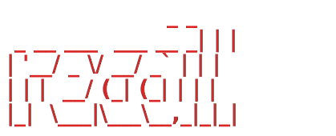
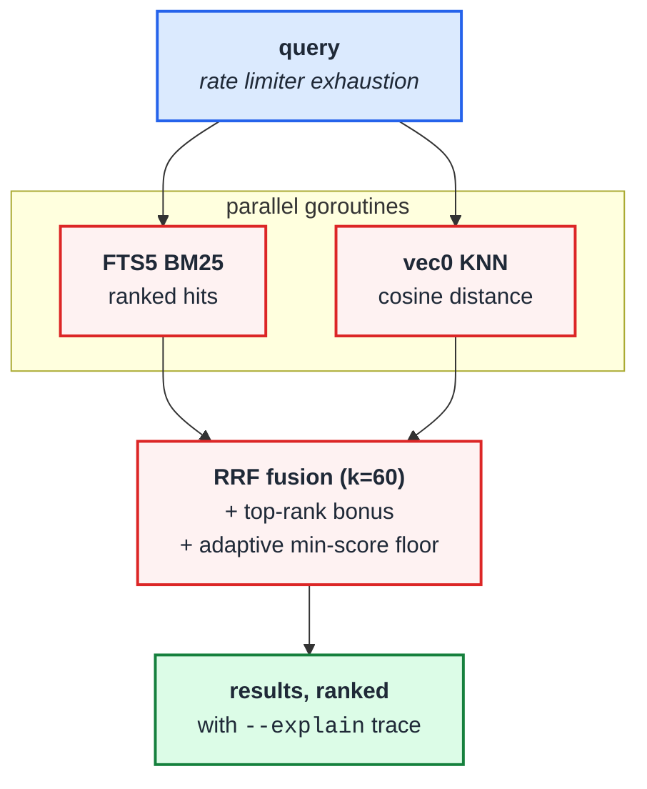

<p align="center">
  
</p>

<p align="center">
  <strong>Local search engine for your notes and documents.</strong><br>
  Markdown, plain text, meeting transcripts, knowledge bases.<br>
  BM25 + vector + hybrid fusion in a single Go binary.
</p>

<p align="center">
  <a href="https://go.dev"></a>
  <a href="LICENSE"></a>
  <a href="#installation"></a>
  <a href="https://github.com/ugurcan-aytar/recall/actions/workflows/ci.yml"></a>
  <a href="CONTRIBUTING.md"></a>
</p>

<p align="center">
  
</p>

---

## What is recall?

recall is an on-device search engine for your personal knowledge base — markdown notes, plain-text files, meeting transcripts, journals, docs. Point it at a folder of writing and it gives you:

- **BM25 full-text search** via SQLite FTS5 — fast, deterministic keyword matching.
- **Vector semantic search** via sqlite-vec — find notes by meaning, not just exact words.
- **Hybrid fusion** — BM25 and vector results combined with Reciprocal Rank Fusion and an adaptive score floor, so vague queries still surface their best match instead of returning nothing.
- **Markdown-aware chunking** — 384-token chunks with 15% overlap, scored at natural break-points so headings stay with their bodies.
- **Local embedding** — a single ~146 MB GGUF model (nomic-embed-text-v1.5, Apache 2.0, ungated) runs in-process. No API calls. No cloud.

Everything lives in one SQLite file and one Go binary. No servers, no Docker, no Node runtime, no Python runtime.

> **Also works with source code.** If you keep READMEs, design docs, and codebases in the same tree, recall indexes them alongside your notes and uses tree-sitter for AST-aware chunking on Go / Python / TypeScript / JavaScript / Java / Rust. Notes are the main use case; code is a natural extension.

## Who is this for?

- You've built up a `~/notes` folder over years and can't find things in it.
- Your team's knowledge base is a pile of markdown across a few repos.
- You run meeting transcripts through a transcription tool and now have hundreds of `.md` files you'd like to query.
- You want "grep for ideas, not just strings" without handing your notes to a cloud service.

## Why another search engine?

Knowledge-base search usually pushes you toward a hosted vector DB, a Node or Python stack, and an OpenAI key. recall takes the opposite position:

- **Local-first, always.** The default path makes zero HTTP requests. Your notes never leave your machine.
- **One binary.** `make build` and you're done — no external services to keep alive.
- **Incremental.** Edit one paragraph; recall re-embeds one chunk, not the whole file.
- **Adaptive scoring.** Vague queries still surface their best result instead of returning an empty list.
- **Library-first.** The CLI is a thin wrapper over `pkg/recall`, so other Go programs can embed the same engine.

recall is designed to be boring infrastructure for your notes. Index once, search forever.

## Quick start

```bash
# 1. Install
brew install ugurcan-aytar/recall/recall    # or grab a binary from releases

# 2. Point recall at a folder of notes
recall collection add ~/notes --name notes  # or any folder of .md / .txt files
recall index

# 3. Full-text search (works immediately, no model needed)
recall search "rate limiter"

# 4. Search syntax: quoted phrases and exclusion
recall search '"circuit breaker" timeout -redis'
#      └── matches docs with the exact phrase "circuit breaker"
#          and the word "timeout", excluding anything that mentions redis.

# 5. (Optional) hybrid BM25 + vector — needs an embedding backend
export RECALL_EMBED_PROVIDER=openai
export OPENAI_API_KEY=sk-…
recall embed
recall query "what did we decide about the launch date" --explain
```

Want to try recall without pointing it at your own data? Clone the repo and use the bundled `examples/` folder of fictional meeting notes, runbook, journal, and incident report:

```bash
git clone https://github.com/ugurcan-aytar/recall.git
recall collection add ./recall/examples --name demo
recall index
recall search "circuit breaker"
```

To use recall on your own notes, replace `./examples` with `~/notes` (or wherever your markdown lives).

## How retrieval works

recall implements the same retrieval pipeline most modern hybrid search systems use, in pure Go, on top of SQLite. The whole pipeline runs in a single process — no server, no IPC.



### BM25

`recall search` runs SQLite FTS5's `bm25()` ranking function over every indexed document. FTS5 returns negative scores (lower = better); recall flips them positive for display. Snippets come from FTS5's built-in `snippet()` with bold ANSI markers around matched terms (suppressed when `NO_COLOR` is set).

Performance: ~5 ms wall time per query on a 79-document / 189-chunk corpus including process startup. The actual SQL runs in microseconds.

### Vector

`recall vsearch` embeds the query (`search_query: …` prefix per nomic's required format), then runs a KNN cosine-distance query against the `chunk_embeddings` `vec0` virtual table. The store keeps **one row per document** (best chunk wins) so results are document-level, not chunk-level.

Similarity is reported as `1 / (1 + distance)` so closer = higher score, easy to compare against BM25's positive-flipped values.

### RRF Fusion

`recall query` runs BM25 and vector concurrently in two goroutines, then fuses the two ranked lists with **Reciprocal Rank Fusion** (Cormack et al. 2009). The classic RRF score for a document `d` is:

```
score(d) = Σ  1 / (k + rank(d, list))
         lists
```

with `k = 60` (the canonical TREC value). recall layers two practical refinements on top:

| Refinement | Value | Purpose |
|---|---|---|
| Top-rank bonus | +0.05 if doc is rank 1 in either list, +0.02 for ranks 2–3 | Boost results that one of the rankers considers obviously best |
| Adaptive min-score floor | drop results below `0.4 × top.Score` | Trim long-tail noise on weak queries — but the floor is *relative*, so weak-but-best results survive instead of returning empty |

`recall query --explain` prints the per-result trace so you can see exactly why each document landed where it did:

```
notes/incident-2026-03-22.md  #07d4c5  (score 0.08)
[explain 1] notes/incident-2026-03-22.md  rrf=0.0328 bonus=0.0500 floor=0.0331 bm25_rank=1 vec_rank=1
```

### Chunking

Documents bigger than the target are split with break-point scoring: H1 = 100, H2 = 90, code fence = 80, blank line = 20, list item = 5, regular line break = 1. The chunker hunts back ≤200 tokens for the highest-scoring break point near the cut point, then echoes the last 15% of each chunk into the next so context spans the seam. Code fences are never split mid-block.

For source files (`.go`, `.py`, `.ts`, `.js`, `.java`, `.rs`) the chunker uses `tree-sitter` to cut at function / method / class / impl / import boundaries instead. Languages without a tree-sitter grammar fall back to the markdown chunker silently.

Default target is **384 estimated tokens** (chunked content fits comfortably under typical BERT-class embedder context windows). Override with `--chunk-strategy` on `recall embed`.

### Incremental re-embedding

When you edit a file and re-run `recall index`, only the chunks whose `content_hash` changed get re-embedded. Editing one paragraph of a 50-page note costs ~1 chunk re-embed, not 50.

## Commands

| Command | What it does |
|---|---|
| `recall collection add <path>` | Register a folder as a collection |
| `recall collection remove <name>` | Remove a collection |
| `recall collection list` | List registered collections |
| `recall collection rename <old> <new>` | Rename a collection |
| `recall ls [collection[/path]]` | List files in a collection |
| `recall index` | Re-scan and index all collections |
| `recall index --pull` | `git pull` each collection before re-indexing |
| `recall embed` | Generate vector embeddings for chunks |
| `recall embed -f` | Force re-embed everything |
| `recall search "<query>"` | BM25 full-text search |
| `recall vsearch "<query>"` | Vector semantic search |
| `recall query "<query>"` | Hybrid: BM25 + vector + RRF fusion |
| `recall query "<query>" --explain` | Hybrid + per-result RRF / bonus / floor / rank trace |
| `recall get <path \| #docid>` | Retrieve a single document |
| `recall multi-get <pattern>` | Batch retrieve by glob or list |
| `recall context add [path] "text"` | Add descriptive context for a path |
| `recall context list` / `rm` / `check` | Manage path contexts |
| `recall status` | Index health, collection sizes, doc / chunk / embedding counts |
| `recall doctor` | Verify database, schema, embedding backend |
| `recall models` / `models download` / `models path` | List, fetch, or locate GGUF models |
| `recall cleanup` | Drop orphan chunks + stale embeddings, run SQLite VACUUM |
| `recall version` | Print version, build date, commit, Go version |

Shared search flags: `-n`, `-c/--collection` (comma-separated for multi-collection), `--all`, `--min-score`, `--full`, `--line-numbers`, `--explain`. Output formats: `--json`, `--csv`, `--md`, `--xml`, `--files`.

### Multi-collection cross-search

Index two repos as separate collections, then search either one, the other, or both at once with `-c repo1,repo2`:

<p align="center">
  
</p>

## Architecture

```
recall
├── cmd/recall/        # CLI entry point (thin main.go)
├── internal/
│   ├── commands/      # One Cobra command per file
│   ├── store/         # SQLite + FTS5 + sqlite-vec + RRF fusion
│   ├── chunk/         # Markdown chunker + tree-sitter AST chunker for code
│   └── embed/         # Local GGUF backend + optional API fallback
└── pkg/recall/        # Public Go API (for library consumers)
```

The pieces:

- **store** — `mattn/go-sqlite3` (with the `sqlite_fts5` build tag) plus `asg017/sqlite-vec-go-bindings/cgo`. WAL mode, 64 MB cache, prepared statements cached for the BM25 hot path.
- **chunk** — markdown break-point scoring is the default. Code files route through `smacker/go-tree-sitter` for AST-aware cuts. Strategy is overridable via `--chunk-strategy auto|regex|ast`.
- **embed** — local GGUF via `godeps/gollama` is the default; the binary keeps the model loaded across the run for amortised load cost. BM25-only commands never load the model. Optional API fallback (`RECALL_EMBED_PROVIDER=openai|voyage`) is opt-in only and never default.
- **pkg/recall** — a stable facade (`NewEngine`, `SearchBM25`, `SearchVector`, `SearchHybrid`, `Index`, `Embed`, `Get`, …) that external Go consumers import.

## Installation

### Homebrew (macOS, Linux)

```bash
brew install ugurcan-aytar/recall/recall
```

### One-line install script

```bash
curl -fsSL https://raw.githubusercontent.com/ugurcan-aytar/recall/main/install.sh | bash
```

The script picks the right pre-built tarball for your OS / arch from the [latest release](https://github.com/ugurcan-aytar/recall/releases/latest), verifies its SHA-256, and installs to `/usr/local/bin` (root) or `~/.local/bin` (user).

### Pre-built binary

Grab a tarball directly from the [releases page](https://github.com/ugurcan-aytar/recall/releases/latest), extract it, and drop the `recall` binary anywhere on your `$PATH`. Currently shipped: `darwin_arm64`, `linux_amd64`. SHA-256 sums in `checksums.txt`.

### From source

For contributors and anyone on a platform without a pre-built binary:

```bash
git clone https://github.com/ugurcan-aytar/recall.git
cd recall
make build         # → ./recall
```

Requires Go 1.24+ with CGo enabled (the default). If you `go install` instead of cloning, you need the `sqlite_fts5` tag — recall hard-fails with an actionable error otherwise:

```bash
go install -tags sqlite_fts5 github.com/ugurcan-aytar/recall/cmd/recall@latest
```

## Vector / hybrid search (optional)

`recall search` (BM25 full-text) works the moment you install — no model, no API. `recall vsearch` and `recall query` need an **embedding backend**. Pick whichever fits how you installed:

**Brew / pre-built users**: the bottle ships **without** the local GGUF model (~146 MB on disk, won't fit in a tap). Use an API:

```bash
export RECALL_EMBED_PROVIDER=openai     # or voyage
export OPENAI_API_KEY=sk-…              # or VOYAGE_API_KEY
recall embed
recall query "your question"
```

`RECALL_EMBED_PROVIDER` defaults to `local`, so the API path is opt-in only — recall never sends data anywhere unless you explicitly set the env var.

**Source builds**: rebuild with the `embed_llama` tag to get the in-process GGUF embedder. The recipe (libbinding.a, model download) is in [CONTRIBUTING.md](CONTRIBUTING.md). Once built, `recall models download` fetches the default model and `recall embed` runs entirely on-device.

Run `recall doctor` any time to see which backend the current binary will use.

## Configuration

| Environment variable | Default | Purpose |
|---|---|---|
| `RECALL_DB_PATH` | `~/.recall/index.db` | SQLite database location |
| `RECALL_MODELS_DIR` | `~/.recall/models/` | GGUF model storage |
| `RECALL_EMBED_PROVIDER` | `local` | `local` (default), `openai`, or `voyage` |
| `RECALL_EMBED_MODEL` | `nomic-embed-text-v1.5.Q8_0.gguf` | Override the local GGUF — bare filename joined with `RECALL_MODELS_DIR`, or absolute path |
| `RECALL_EMBED_PROMPT_FORMAT` | _detected from filename_ | Force a prompt family — `nomic`, `gemma` / `embeddinggemma`, `qwen` / `qwen3`, or `generic` / `raw` / `none` |
| `OPENAI_API_KEY` | — | Only read when `RECALL_EMBED_PROVIDER=openai` |
| `VOYAGE_API_KEY` | — | Only read when `RECALL_EMBED_PROVIDER=voyage` |
| `NO_COLOR` | — | Set to any value to disable ANSI colors |

### Bringing your own embedding model

The default `nomic-embed-text-v1.5` covers most use cases, but you can
point recall at a different GGUF without rebuilding:

```sh
# Drop a model into RECALL_MODELS_DIR (default ~/.recall/models/)
mv ~/Downloads/embeddinggemma-300m.Q8_0.gguf ~/.recall/models/

# Tell recall to use it
export RECALL_EMBED_MODEL=embeddinggemma-300m.Q8_0.gguf
recall embed -f          # -f drops old vectors that were embedded with nomic
recall query "..."
```

Recall auto-detects the prompt family from the filename — `nomic-`,
`embeddinggemma-`, and `Qwen3-Embedding-` patterns are recognised and
get the right `task: …` / `Instruct: …` / `search_query: …` prefix
applied. Set `RECALL_EMBED_PROMPT_FORMAT` if you have a model whose
filename doesn't hint at its family. The model dimension must match
recall's vec0 schema (768d); embedders that return a different width
will fail at `recall embed` with a clear error.

## Using recall as a Go library

```go
package main

import (
    "fmt"
    "log"

    "github.com/ugurcan-aytar/recall/internal/embed"
    "github.com/ugurcan-aytar/recall/pkg/recall"
)

func main() {
    eng, err := recall.NewEngine(recall.WithDBPath("./index.db"))
    if err != nil {
        log.Fatal(err)
    }
    defer eng.Close()

    if _, err := eng.AddCollection("notes", "/path/to/notes", "", "team notes"); err != nil {
        log.Fatal(err)
    }
    if _, err := eng.Index(); err != nil {
        log.Fatal(err)
    }

    // For vector search, supply any Embedder. Production code uses
    // embed.NewLocalEmbedder (GGUF) or embed.NewAPIEmbedder. Tests use
    // embed.NewMockEmbedder.
    emb := embed.NewMockEmbedder(0)
    defer emb.Close()
    if _, err := eng.Embed(emb, false); err != nil {
        log.Fatal(err)
    }

    results, err := eng.SearchHybrid(emb, "Q3 launch decisions", recall.WithLimit(10))
    if err != nil {
        log.Fatal(err)
    }
    for _, r := range results {
        fmt.Printf("%s/%s  score=%.4f\n", r.CollectionName, r.Path, r.FusedScore)
    }
}
```

The public API lives in `pkg/recall`. `internal/` is off-limits for external consumers.

## Status

recall is pre-1.0. CLI flags, the public Go API, and the SQLite schema may shift between minor versions; semver patches stay backwards-compatible.

## Contributing

Bug reports, feature requests, and PRs are welcome. See [CONTRIBUTING.md](CONTRIBUTING.md) for the dev setup, CGo build notes, and commit conventions. Security issues: see [SECURITY.md](SECURITY.md).

## Credits

recall's architecture is inspired by [qmd](https://github.com/tobi/qmd) by Tobi Lütke — the chunking strategy, RRF fusion, and overall shape of the CLI owe a lot to that project. recall diverges in a few places (no separate reranker model, no query-expansion model, incremental re-embedding, adaptive min-score, AST-aware code chunking from day one) — those are deliberate, not accidental.

## License

MIT — see [LICENSE](LICENSE).
